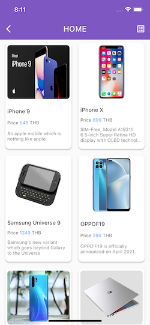
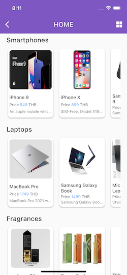

# Gunkul Demo

It's a demo project for testing. It works in MVC pattern and integrates with GetX state management.


## Features

- Authentication - Login screen
- Profile Information screen
- Theme mode - Dark mode and Light mode
- Products screen
- [GetX](https://pub.dev/packages/get) state management


## API Reference

#### Example: Get single user

```http
  GET ${your_domain}/user/$userId
```

| Parameter | Type     | Description                |
| :-------- | :------- | :------------------------- |
| `userId` | `int` | **API document** is attached in the Requirement message.|


#### Environment Security

This project uses [flutter_dotenv](https://pub.dev/packages/flutter_dotenv) for protecting access to confidential API code. If you want to play around with the project, please bring the .env file attached to the reply email before testing.

## Run Project

Clone the project

```bash
  git clone https://github.com/Chopperz/gunkul_demo.git
```

Go to the project directory

```bash
  cd gunkul_demo
```

Install dependencies

```bash
  flutter pub get
```

And also install engine-base for create a model object data file used by [json_serializable](https://pub.dev/packages/json_serializable) to create code for JSON serialization and deserialization. Btw. The project requires use of The [build_runner](https://pub.dev/packages/build_runner) package provides a concrete way to generate files using Dart code. Files are always generated directly on disk.

```bash
  dart run build_runner build
```

Or

```bash
  dart run build_runner build --delete-conflicting-outputs
```

until it's done. it can run the project right away.

```bash
  flutter run
```


## Screenshots

)

)

)

)

)